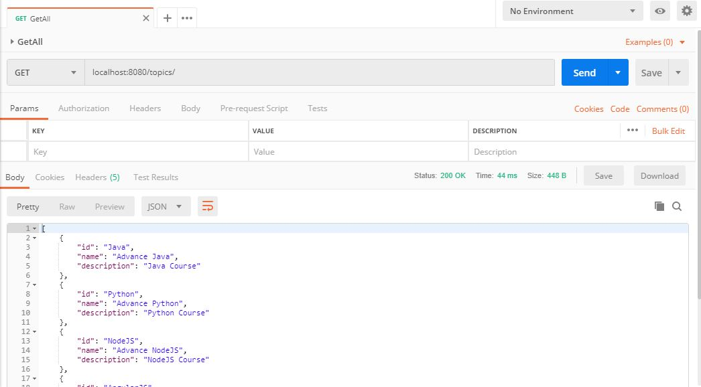
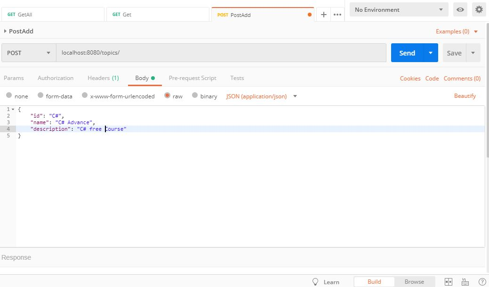
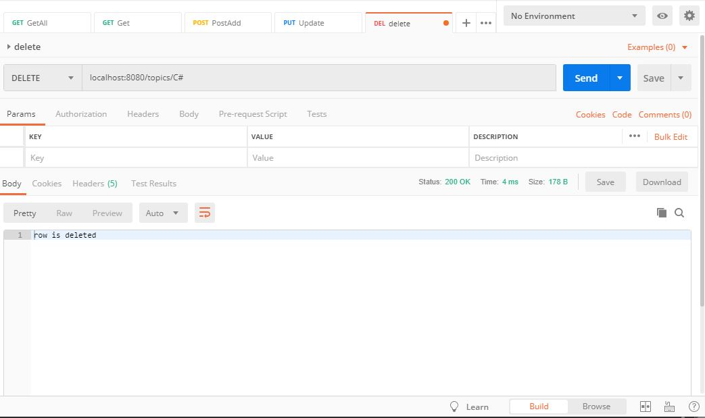

# Simple-satatic-crud
Simple static crud operations using spring boot.
it is just to test Spring boot features on system.
Static database is nothig but a List collection with embedded tomcat server, so this project is standalone project (ready to run).

1. Get all data

2. Add topic data

3. Delete topic data

